## Step 1: Initialize the Service-Based Architecture (SBA) Dashboard

1. **Open the SBA Simulator Dashboard:**
Launch the dashboard where all 5G Core Network Functions (NFs) are displayed and managed.

2. **Verify Initialization:**
Once the dashboard loads, ensure all essential panels (NF List, Configuration Panel, Logs, Terminal) are visible and active.

You should now be ready to start configuring and launching NFs.

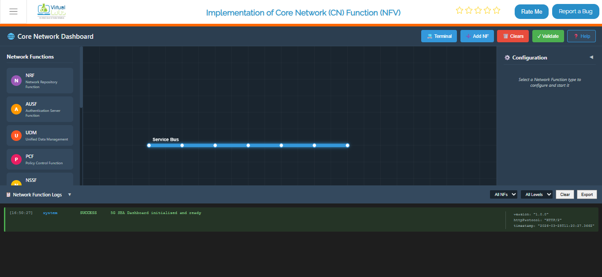

*Fig:Service-Based Architecture (SBA) Dashboard*

## Step 2: Start Network Functions (NF)

Network Functions can be deployed using either the Terminal (Docker Compose) or the GUI-based configuration panel.
Both methods result in the same NF topology and services.

### Method A: Deploy Network Functions Using Terminal (Docker Compose)

This method allows you to deploy Network Functions using predefined Docker Compose configurations.

#### 2.1 Launch Network Functions one by one

Click on the terminal button to open the terminal then from the project root directory, execute the following command:

```bash
docker compose -f docker-compose.yml up -d nf_name
```
Example:

```bash
docker compose -f docker-compose.yml up -d oai-nrf
```

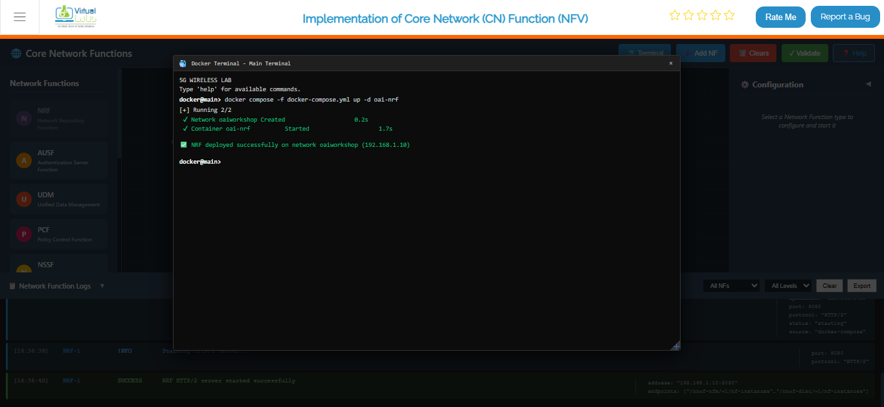

*Fig: Deployment of NRF*

After the deployment it would be stable in 5-10 seconds

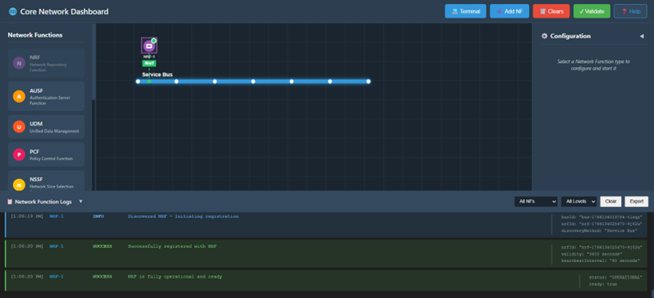

*Fig: NRF Deployed*

This confirms that NRF deployed successfully.


#### 2.2 Launch All Network Functions in just one command

Click on the terminal button to open the terminal then from the project root directory, execute the following command:

```bash
docker compose -f docker-compose.yml up -d
```

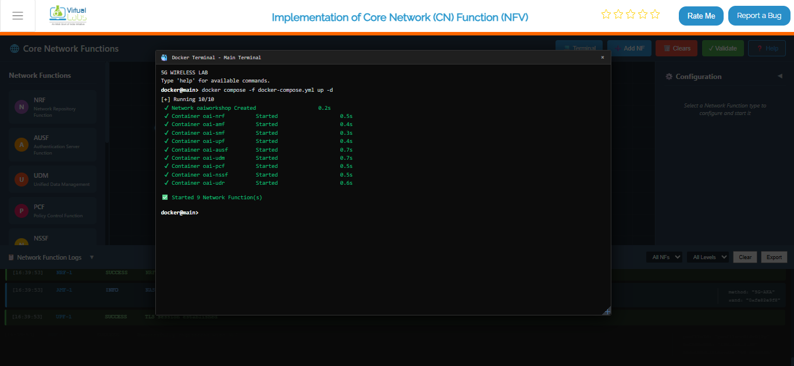

*Fig: Deployment of Network Function*

This confirms that all core NFs and supporting services are running successfully.

#### 2.3 Verify Docker Network Creation

List available Docker networks:

```bash
docker network ls
```

You should see the oaiworkshop network:

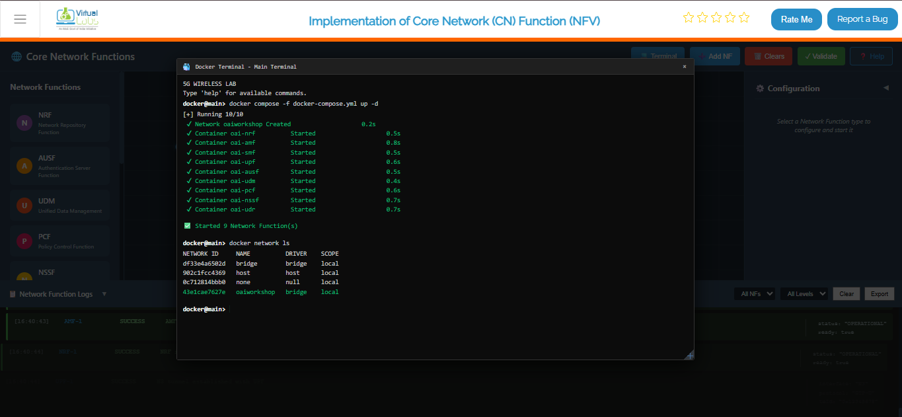

*Fig: list of available docker network*

#### 2.4 Inspect Network and NF IP Assignment

Inspect the OAI network to verify IP allocation:

```bash
docker network inspect oaiworkshop
```

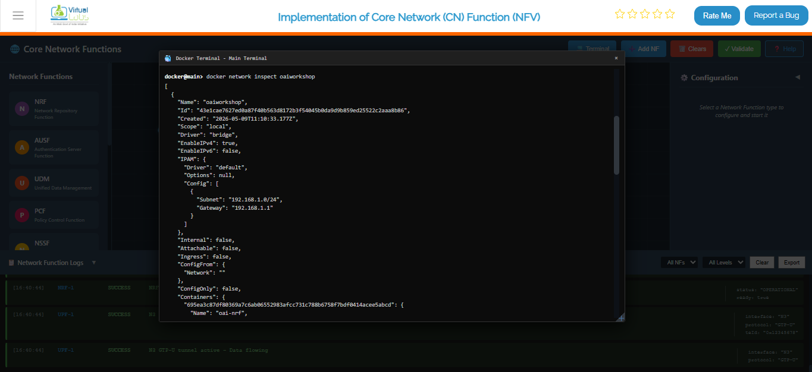

*Fig: Inspect of OAI Network*

This confirms successful NF deployment and network stabilization.

#### 2.5 Stop and Remove All Network Functions

To stop and clean up all running containers and networks:

```bash
docker compose -f docker-compose.yml down
```

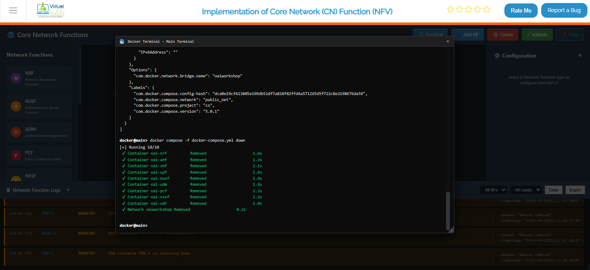

*Fig: Stop all running containers*


### Method B: Deploy Network Functions Using GUI

This method allows individual NF configuration and startup via the graphical interface.

#### 1. Select an NF to Configure

Click on the NF icon from the NF list that you want to start (e.g., AMF, SMF, UPF, NRF, etc.).
This will open its Configuration Panel on the right side.

#### 2. Enter NF Configuration Details

In the configuration panel, fill in the required fields:

- **IP Address:**
Provide a valid IPv4 address for the NF (e.g., 192.168.1.10).

- **Port Number:**
Enter the port on which the NF will run (e.g., 8080 or any defined port).

- **Protocol:**
Select HTTP/1 or HTTP/2 depending on your NF requirement.
(Some NFs may auto-select based on preset settings.)

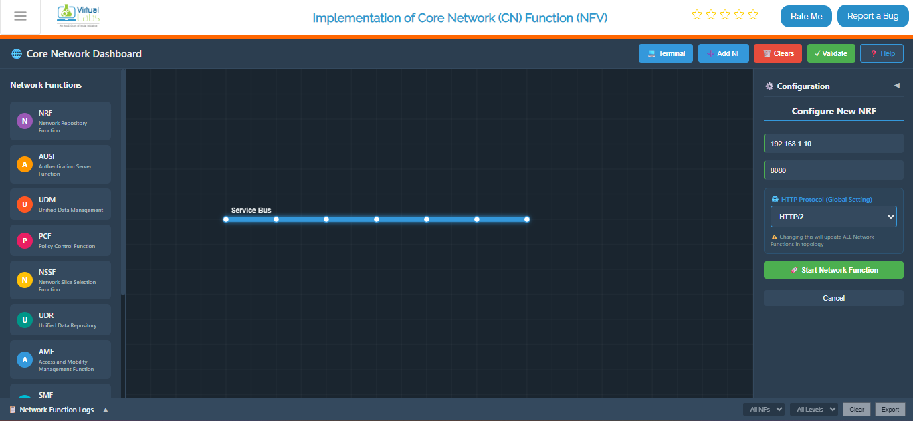

*Fig: Select NF and Configure*

#### 3. Start the NF

Click the Start NF button to launch the service.

#### 4. Wait for NF Stabilization

Once you click Start NF:

- The NF begins initializing.
- Allow approximately 5 seconds for the NF to become stable.

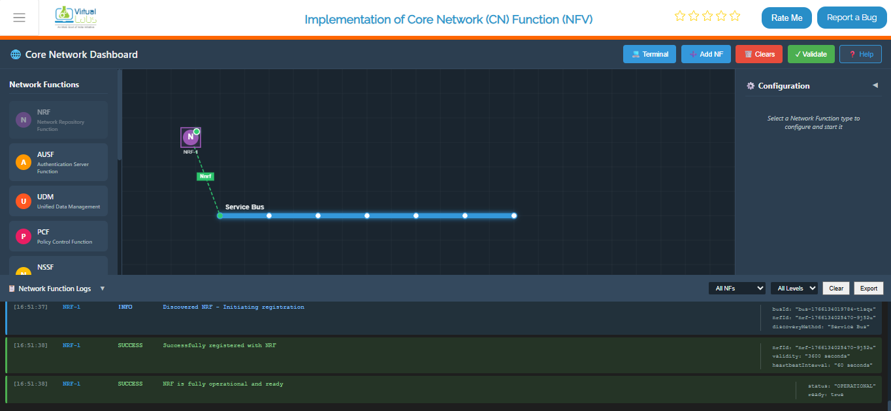

*Fig: NF Stabilization*

#### 5. Verify NF Startup Logs

Scroll down to the NF Logs section.
A successful startup will display logs such as:

- NF started successfully
- Service registration complete
- NF ready to accept connections

#### 6. Repeat for All Remaining NFs

Follow the same configuration and startup process to start each NF in the architecture:

- AMF
- SMF
- UPF
- UDM
- AUSF
- NRF
- PCF
- UDR
- NSSF

Make sure each one stabilizes and shows successful log entries.

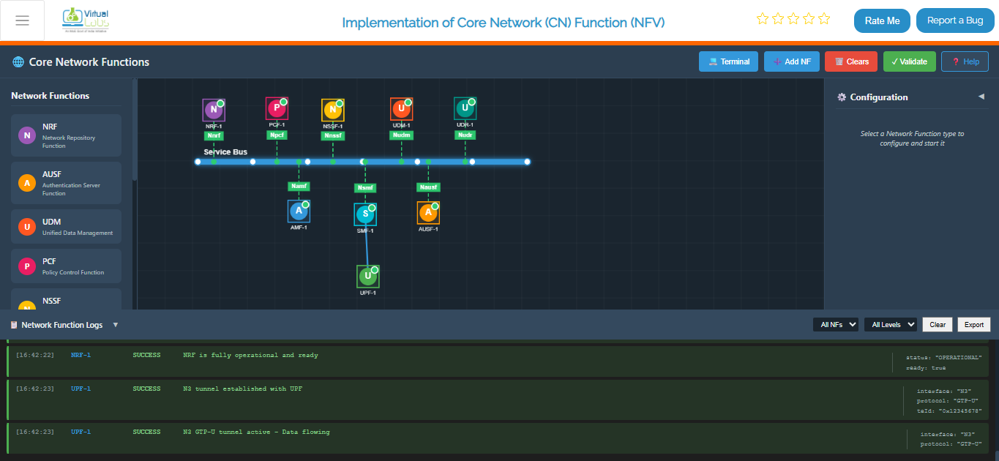

*Fig: All Network Functions are running*


## Step 3: Connectivity Validation

### Test Network Connection Between NFs

If you want to verify whether two NFs are connected and reachable, you can use the Ping Test through the terminal.

#### Step 3.1: Open NF Terminal

1. **Select the NF You Want to Test:**
Click on the NF icon (e.g., AMF).

2. **Open Terminal:**
In the Configuration Panel, scroll down and click the Open Command Prompt / Terminal button.
This opens a terminal window showing:
- NF name
- NF IP address

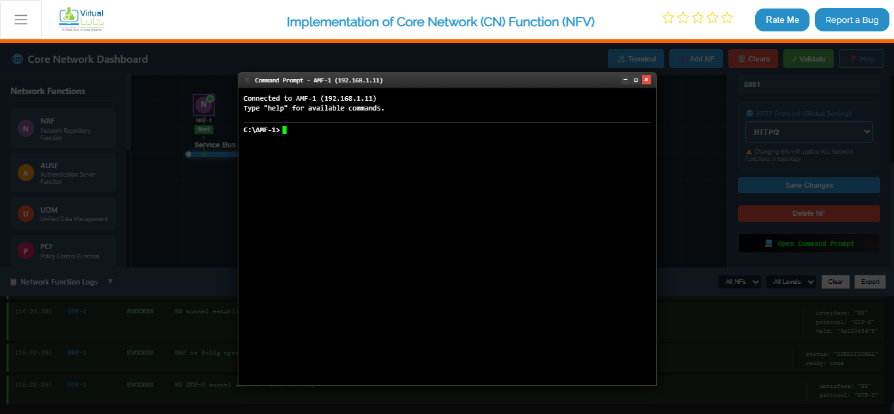

*Fig: NF Terminal*

#### Step 3.2: Perform Ping Test

1. Enter the Ping Command in the terminal 

```bash
ping <target_NF_IP>
```

Example:

```bash
ping 192.168.1.14
```

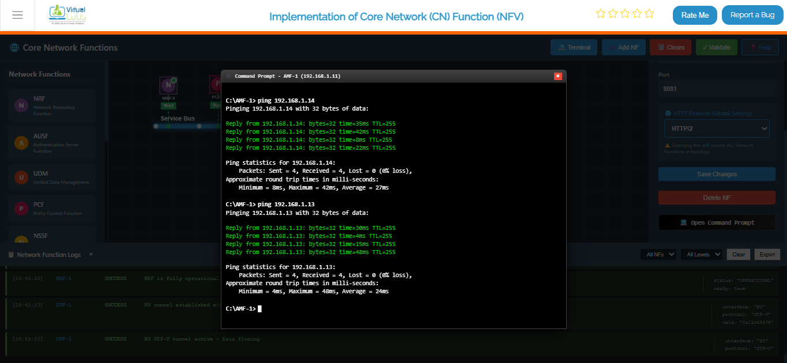

*Fig: ping test*

2. **Check Ping Output:**
The terminal will display a series of responses such as:

- Reply from 192.168.1.14: bytes=32 time<1ms
- Reply from 192.168.1.14: bytes=32 time=2ms

3. **Analyze the Results:**
When the ping completes, a summary will appear:

- Packets Sent: 4
- Packets Received: 4
- Packet Loss: 0%

This confirms that both NFs are successfully connected and can communicate with each other within the simulated network.

