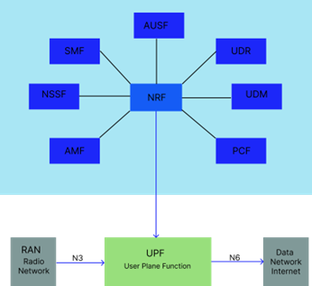
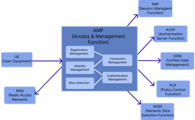
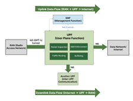
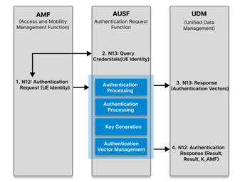
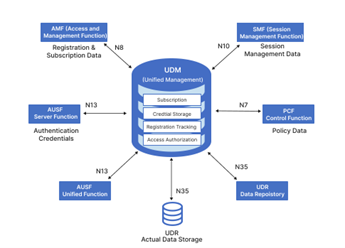
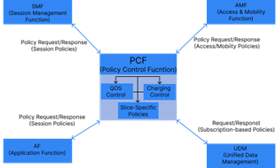
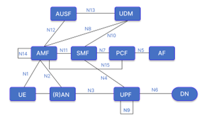

## 1. Introduction to 5G Core Network Architecture

The 5G core network implements a Service-Based Architecture (SBA) that represents a paradigm shift from traditional monolithic architectures. Unlike its 4G predecessor, 5G adopts a modular, microservice-based design where network functions operate independently and can be scaled according to demand.

The core network architecture is strategically divided into two distinct planes:

* **Control Plane**: Responsible for signaling, session management, and policy enforcement
* **User Plane**: Handles actual data packet forwarding and routing

This architectural separation, known as Control and User Plane Separation (CUPS), enables flexible deployment strategies and optimized resource utilization.

*Fig: 5G Core Network Service-Based Architecture*

<strong>2. Containerization and Orchestration</strong>

## 2. Containerization and Orchestration

### 2.1 Docker: Container Platform

Docker has revolutionized application deployment by introducing lightweight, portable containers that package applications with all their dependencies. In 5G Core deployment, Docker provides several critical advantages.

#### Key Docker Concepts:
* **Container Images**: Read-only templates containing application code, runtime, libraries, and configuration files
* **Containers**: Running instances of Docker images, providing isolated environments for network functions
* **Docker Engine**: Runtime that creates and manages containers on the host operating system
* **Docker Registry**: Repository for storing and distributing container images

#### Benefits for 5G Core Deployment:
* **Isolation**: Each network function runs in its own container
* **Portability**: Consistent execution across environments
* **Resource Efficiency**: Shared host OS kernel
* **Rapid Deployment**: Quick instantiation and scaling
* **Version Control**: Support for multiple versions

---

### 2.2 Kubernetes: Container Orchestration

While Docker manages individual containers, Kubernetes orchestrates containerized applications across machine clusters, providing enterprise-level automation and reliability for production-grade 5G Core deployments.

#### Core Kubernetes Concepts:
* **Pods**: Smallest deployable units containing network function containers
* **Services**: Stable network endpoints and load balancing
* **Deployments**: Declarative application state definitions
* **ConfigMaps and Secrets**: Configuration and sensitive data management
* **Namespaces**: Virtual cluster separation
* **Ingress Controllers**: External access management

#### Kubernetes Architecture Components:

**Master Node (Control Plane)**:
* API Server: Central management point
* Scheduler: Pod assignment
* Controller Manager: Cluster state maintenance
* etcd: Configuration store

**Worker Nodes**:
* Kubelet: Pod management agent
* Container Runtime: Container execution
* Kube-proxy: Network rules management

*Fig: Kubernetes Architecture for 5G Core Network Deployment*

<strong>3. Network Function Roles and Responsibilities</strong>

## 3. Network Function Roles and Responsibilities

### 3.1 Access and Mobility Management Function (AMF)

**Role**: Primary control plane gateway for user equipment (UE)

#### Key Responsibilities:
* **Registration Management**: Handles UE registration and deregistration procedures
* **Connection Management**: Manages signaling connections between UE and core network
* **Mobility Management**: Tracks UE location and manages mobility events
* **Authentication Coordination**: Works with AUSF to authenticate UE during initial access
* **Network Slice Selection**: Selects appropriate network slice for UE based on subscription
* **SMF Selection**: Chooses suitable SMF for PDU session establishment
* **Paging Management**: Triggers paging when downlink data arrives for idle UEs

#### Key Interfaces:
* **N1**: Communication with UE (NAS signaling)
* **N2**: Communication with RAN (NGAP protocol)
* **N11**: Communication with SMF for session management
* **N12**: Communication with AUSF for authentication
* **N15**: Communication with PCF for policy decisions

*Fig: AMF Functions and Interface Connections*

---

### 3.2 Session Management Function (SMF)

**Role**: Orchestrates all PDU (Protocol Data Unit) session operations

#### Key Responsibilities:
* **Session Management**:
  * Establishment of new PDU sessions
  * Modification of session parameters
  * Termination of inactive sessions
* **IP Address Allocation**: Assigns IP addresses to UE for data sessions
* **UPF Selection and Control**: Selects appropriate UPF and configures packet forwarding rules
* **QoS Management**: Applies Quality of Service policies to data flows
* **Charging Data Collection**: Gathers usage information for billing purposes

#### Key Interfaces:
* **N4**: Communication with UPF (PFCP protocol) for session configuration
* **N7**: Communication with PCF for policy rules
* **N10**: Communication with UDM for subscription data
* **N11**: Communication with AMF for session signaling

*Fig: SMF Functions and Interface Connections*

---

### 3.3 User Plane Function (UPF)

**Role**: Handles all user data packet processing and forwarding

#### Key Responsibilities:
* **Packet Operations**:
  * Routing between RAN and external networks
  * Forwarding based on SMF rules
  * Deep packet inspection for policy enforcement
* **QoS Enforcement**: Applies traffic shaping and prioritization rules
* **Packet Buffering**: Buffers downlink packets for UEs in idle mode
* **Traffic Measurement**: Collects traffic statistics for reporting
* **Lawful Interception**: Supports legal data interception when required

#### Key Interfaces:
* **N3**: Communication with RAN (GTP-U protocol) for user data
* **N4**: Communication with SMF (PFCP protocol) for configuration
* **N6**: Communication with Data Network (Internet/Enterprise networks)
* **N9**: Communication with other UPFs for distributed deployments

*Fig: UPF Data Plane Operations and Connections*

---

### 3.4 Authentication Server Function (AUSF)

**Role**: Performs authentication services for UE network access

#### Key Responsibilities:
* **UE Authentication**: Validates UE credentials during registration
* **Authentication Method Support**: Supports 5G-AKA and EAP-AKA' protocols
* **Security Key Generation**: Creates encryption and integrity protection keys
* **Authentication Vector Management**: Retrieves and processes authentication data from UDM
* **Re-authentication**: Triggers periodic authentication when security context expires

#### Key Interfaces:
* **N12**: Communication with AMF for authentication requests
* **N13**: Communication with UDM for authentication credentials

*Fig: AUSF Authentication Process and Connections*

---

### 3.5 Unified Data Management (UDM)

**Role**: Central repository for subscriber data and credentials

#### Key Responsibilities:
* **Subscription Management**:
  * Stores and provides subscriber profile information
  * Maintains authentication keys and vectors
* **UE Registration**: Tracks UE registration status across the network
* **Access Authorization**: Validates UE access rights and restrictions
* **Subscription Data Provisioning**: Delivers subscription data to requesting network functions

#### Key Interfaces:
* **N8**: Communication with AMF for registration and subscription data
* **N10**: Communication with SMF for session-related subscription data
* **N13**: Communication with AUSF for authentication credentials
* **N35**: Communication with UDR for data storage

*Fig: UDM Data Management and Connections*

---

### 3.6 Policy Control Function (PCF)

**Role**: Provides unified policy framework for network behavior

#### Key Responsibilities:
* **Policy Management**:
  * Defines and enforces network policies
  * Determines QoS parameters for sessions
  * Applies charging policies for billing
* **Policy Provisioning**:
  * Session-specific rules to SMF
  * Access and mobility policies to AMF
  * Network slice policies

#### Key Interfaces:
* **N5**: Communication with Application Functions for app-specific policies
* **N7**: Communication with SMF for session policies
* **N15**: Communication with AMF for access and mobility policies
* **N36**: Communication with UDM for policy-related subscription data

*Fig: PCF Policy Framework and Connections*

---

### 3.7 Network Repository Function (NRF)

**Role**: Service discovery and registration for network functions

#### Key Responsibilities:
* **Network Function Registry**: Maintains registry of available network functions
* **Service Discovery**: Enables network functions to discover each other
* **Profile Management**: Stores capability and status information
* **Selection Support**: Helps select appropriate instances based on criteria
* **Authorization**: Validates access tokens for service-based communication

*Fig: NRF Service Discovery Architecture*

<strong>4. Network Function Interconnections</strong>

## 4. Network Function Interconnections

All network functions collaborate through standardized interfaces to provide seamless mobile connectivity. The control plane functions (AMF, SMF, AUSF, UDM, PCF, NRF) manage signaling and policies, while the user plane function (UPF) handles actual data traffic. This modular architecture enables flexible deployment, independent scaling, and efficient resource utilization.

*Fig: Complete 5G Core Network Function Interconnection Map*

