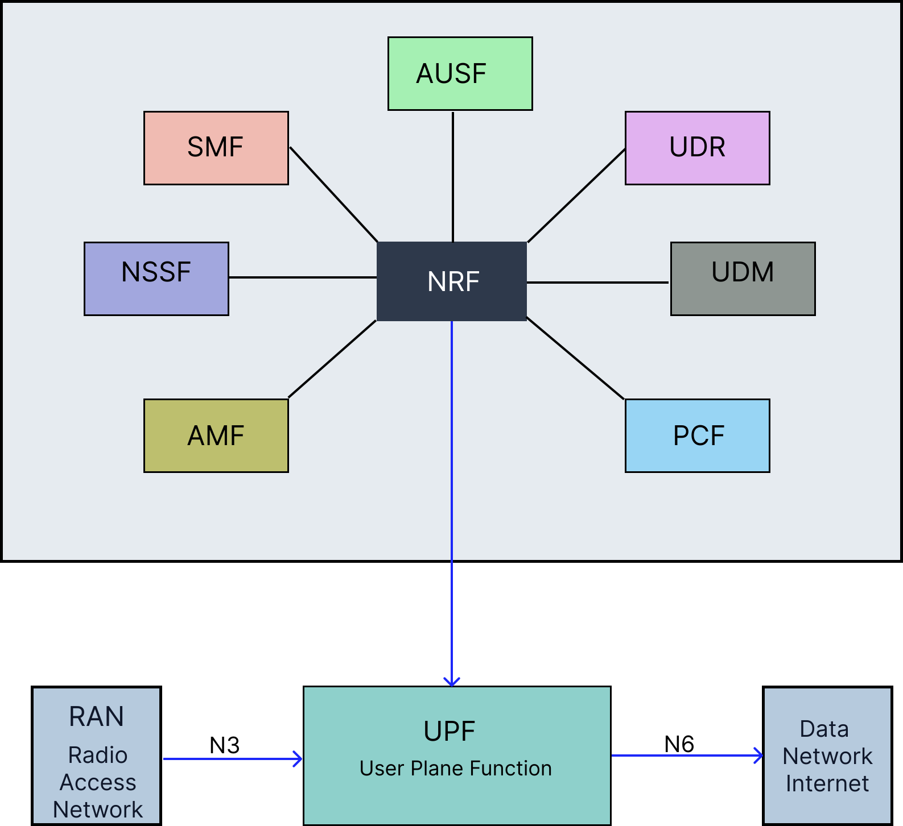
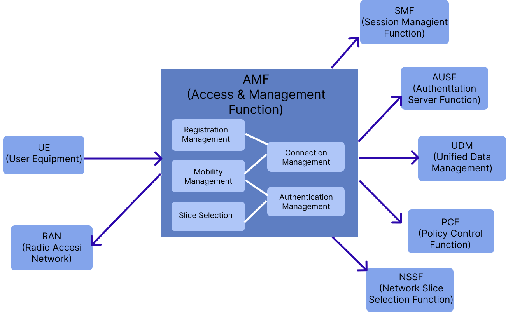
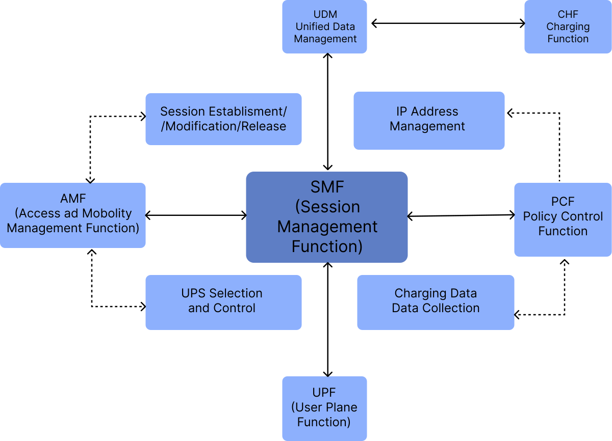
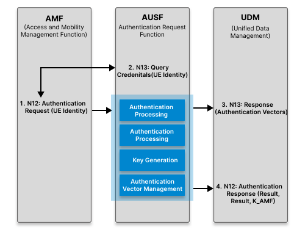
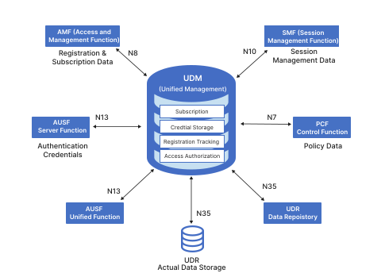
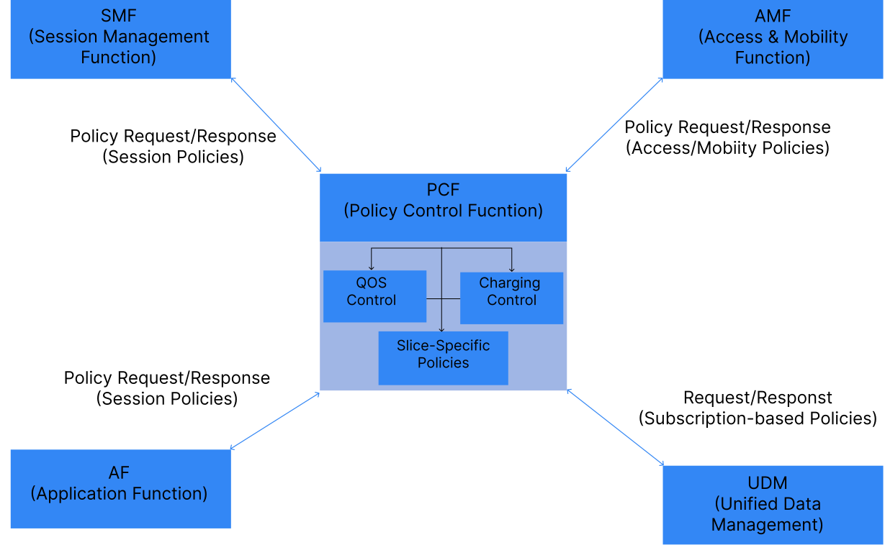
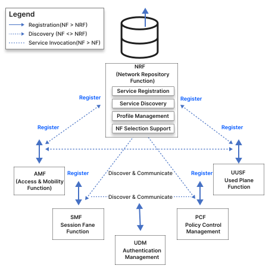
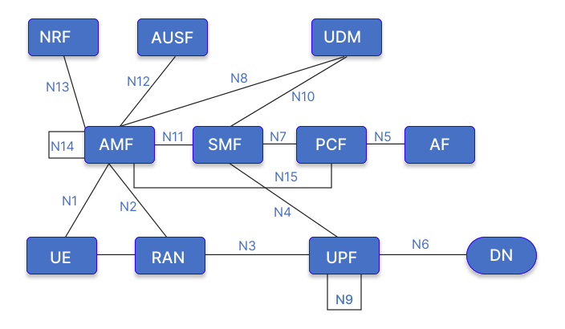

## 1. Introduction to 5G Core Network Architecture

The 5G core network implements a Service-Based Architecture (SBA) that represents a paradigm shift from traditional monolithic architectures. Unlike its 4G predecessor, 5G adopts a modular, microservice-based design where network functions operate independently and can be scaled according to demand.

The core network architecture is strategically divided into two distinct planes:

<ol type="a">
<li><b>Control Plane</b>: Responsible for signaling, session management, and policy enforcement</li>
<li><b>User Plane</b>: Handles actual data packet forwarding and routing</li>
</ol>

This architectural separation, known as Control and User Plane Separation (CUPS), enables flexible deployment strategies and optimized resource utilization.

*Fig: 5G Core Network Service-Based Architecture*

This figure illustrates the Service-Based Architecture of the 5G Core Network, highlighting the separation of the Control Plane, which consists of various interconnected network functions (like AMF, SMF, PCF), and the User Plane, which handles the actual data traffic through the UPF.

## 2. Containerization and Orchestration

Containerization and orchestration technologies provide the foundational infrastructure for deploying and managing 5G core network functions in production environments. These technologies enable scalable, resilient, and efficient network function deployment.

### 2.1 Docker: Container Platform

Docker has revolutionized application deployment by introducing lightweight, portable containers that package applications with all their dependencies. In 5G Core deployment, Docker provides several critical advantages.

<ol type="a">
  <li><b>Container Images</b>: Read-only templates containing application code, runtime, libraries, and configuration files.</li>
  <li><b>Containers</b>: Running instances of Docker images, providing isolated environments for network functions.</li>
  <li><b>Docker Engine</b>: Runtime that creates and manages containers on the host operating system.</li>
  <li><b>Docker Registry</b>: Repository for storing and distributing container images.</li>
</ol>

<h4>Benefits for 5G Core Deployment:</h4>
<ol type="a">
  <li><b>Isolation</b>: Each network function runs in its own container</li>
  <li><b>Portability</b>: Consistent execution across environments</li>
  <li><b>Resource Efficiency</b>: Shared host OS kernel</li>
  <li><b>Rapid Deployment</b>: Quick instantiation and scaling</li>
  <li><b>Version Control</b>: Support for multiple versions</li>
</ol>

### 2.2 Kubernetes: Container Orchestration

While Docker manages individual containers, Kubernetes orchestrates containerized applications across machine clusters, providing enterprise-level automation and reliability for production-grade 5G Core deployments.

<h4>Core Kubernetes Concepts:</h4>
<ol type="a">
  <li><b>Pods</b>: Smallest deployable units containing network function containers</li>
  <li><b>Services</b>: Stable network endpoints and load balancing</li>
  <li><b>Deployments</b>: Declarative application state definitions</li>
  <li><b>ConfigMaps and Secrets</b>: Configuration and sensitive data management</li>
  <li><b>Namespaces</b>: Virtual cluster separation</li>
  <li><b>Ingress Controllers</b>: External access management</li>
</ol>

<h4>Kubernetes Architecture Components:</h4>

- **Master Node (Control Plane):**
<ol type="i">
  <li>API Server: Central management point</li>
  <li>Scheduler: Pod assignment</li>
  <li>Controller Manager: Cluster state maintenance</li>
  <li>etcd: Configuration store</li>
</ol>

- **Worker Nodes:**
<ol type="i">
  <li>Kubelet: Pod management agent</li>
  <li>Container Runtime: Container execution</li>
  <li>Kube-proxy: Network rules management</li>
</ol>

### 2.3 Open-Source 5G Core Implementations: OAI and Open5GS
 
Beyond the underlying container and orchestration layer, open-source software stacks provide ready-to-deploy implementations of the 5G core network functions described in this document. Two of the most widely adopted projects for research, testbeds, and proof-of-concept deployments are OpenAirInterface (OAI) and Open5GS.
 
<h4> 2.3.1 OpenAirInterface </h4>
 
OpenAirInterface is an open-source project maintained by the OpenAirInterface Software Alliance, providing a full software-based implementation of both the radio access network (RAN) and the 5G core network functions.
 
<ol type="a">
  <li><b>OAI-CN5G</b>: A cloud-native implementation of the 5G core, with each network function (AMF, SMF, UPF, AUSF, UDM, PCF, NRF, etc.) packaged as an independent Docker container, aligned with the Service-Based Architecture described in Section 1.</li>
  <li><b>OAI-RAN</b>: Software implementation of gNB and UE functionality, enabling end-to-end 5G testbeds using software-defined radios.</li>
  <li><b>Standards Alignment</b>: Closely tracks 3GPP Release specifications, making it a common reference platform for 5G research and standardization work.</li>
  <li><b>Kubernetes Support</b>: Official Helm charts allow OAI-CN5G network functions to be deployed and orchestrated on Kubernetes clusters, as described in Section 2.2.</li>
</ol>
 
<h4> 2.3.2 Open5GS </h4>
 
Open5GS is an open-source project implementing both 4G EPC and 5G core network functions in C, designed for lightweight deployment and ease of integration.
 
<ol type="a">
  <li><b>Modular NF Implementation</b>: Provides independent binaries/containers for AMF, SMF, UPF, AUSF, UDM, UDR, PCF, NRF, and NSSF, mirroring the modular design principles outlined in Section 1.</li>
  <li><b>Deployment Flexibility</b>: Can be run as native Linux processes, Docker containers, or via Helm charts on Kubernetes, supporting the same containerization workflow described in Section 2.1–2.2.</li>
  <li><b>WebUI and Subscriber Management</b>: Includes a MongoDB-backed WebUI for provisioning subscriber data, commonly used alongside UDM/UDR for testbed configuration.</li>
  <li><b>Interoperability</b>: Frequently paired with third-party RAN simulators (e.g., UERANSIM) or OAI-RAN for end-to-end testing, since it implements standard 3GPP N1–N4 interfaces.</li>
</ol>

 
<h4> 2.3.3 OAI vs. Open5GS: Practical Comparison </h4>
 
<ol type="a">
  <li><b>Primary Use Case</b>: OAI is favored for combined RAN+Core research and standards-compliant experimentation; Open5GS is favored for lightweight, quick-to-deploy core-only testbeds.</li>
  <li><b>Language/Footprint</b>: Open5GS (C) is generally lighter-weight; OAI-CN5G (C/C++) offers deeper RAN integration at the cost of higher setup complexity.</li>
  <li><b>Community and Tooling</b>: Both maintain active Kubernetes/Helm deployment support, making either suitable for the containerized architecture discussed in Section 2.</li>
</ol>

## 3. Network Function Roles and Responsibilities

The 5G core network comprises multiple specialized network functions that work in coordination to provide seamless mobile connectivity, session management, authentication, and policy enforcement. Each function has specific roles and responsibilities within the overall architecture.

### 3.1 Access and Mobility Management Function (AMF)

**Role**: Primary control plane gateway for user equipment (UE)
<h4>Key Responsibilities:</h4>
<ol type="a">
  <li><b>Registration Management</b>: Handles UE registration and deregistration procedures</li>
  <li><b>Connection Management</b>: Manages signaling connections between UE and core network</li>
  <li><b>Mobility Management</b>: Tracks UE location and manages mobility events</li>
  <li><b>Authentication Coordination</b>: Works with AUSF to authenticate UE during initial access</li>
  <li><b>Network Slice Selection</b>: Selects appropriate network slice for UE based on subscription</li>
  <li><b>SMF Selection</b>: Chooses suitable SMF for PDU session establishment</li>
  <li><b>Paging Management</b>: Triggers paging when downlink data arrives for idle UEs</li>
</ol>

<h4>Key Interfaces:</h4>
<ol type="a">
  <li><b>N1</b>: Communication with UE (NAS signaling)</li>
  <li><b>N2</b>: Communication with RAN (NGAP protocol)</li>
  <li><b>N11</b>: Communication with SMF for session management</li>
  <li><b>N12</b>: Communication with AUSF for authentication</li>
  <li><b>N15</b>: Communication with PCF for policy decisions</li>
</ol>

<i>Fig: AMF Functions and Interface Connections</i>

This diagram depicts the Access and Mobility Management Function (AMF) and its primary interfaces. It shows how the AMF acts as the central control point for access network connections, communicating with the User Equipment (UE) via the N1 interface, the Radio Access Network (RAN) via the N2 interface, and other core network functions like the SMF, AUSF, and PCF for comprehensive connection and mobility management.

<h3>3.2 Session Management Function (SMF)</h3>

<b>Role</b>: Orchestrates all PDU (Protocol Data Unit) session operations

<h4>Key Responsibilities:</h4>
<ol type="a">
  <li><b>Session Management</b>:
    <ol type="i">
      <li>Establishment of new PDU sessions</li>
      <li>Modification of session parameters</li>
      <li>Termination of inactive sessions</li>
    </ol>
  </li>
  <li><b>IP Address Allocation</b>: Assigns IP addresses to UE for data sessions</li>
  <li><b>UPF Selection and Control</b>: Selects appropriate UPF and configures packet forwarding rules</li>
  <li><b>QoS Management</b>: Applies Quality of Service policies to data flows</li>
  <li><b>Charging Data Collection</b>: Gathers usage information for billing purposes</li>
</ol>

<h4>Key Interfaces:</h4>
<ol type="a">
  <li><b>N4</b>: Communication with UPF (PFCP protocol) for session configuration</li>
  <li><b>N7</b>: Communication with PCF for policy rules</li>
  <li><b>N10</b>: Communication with UDM for subscription data</li>
  <li><b>N11</b>: Communication with AMF for session signaling</li>
</ol>

<i>Fig: SMF Functions and Interface Connections</i>

This figure outlines the Session Management Function (SMF) and its interconnections within the 5G core. It illustrates the SMF's role in managing user sessions by interacting with the AMF for control signaling, the UDM for subscription data, the PCF for policy enforcement, and the UPF via the N4 interface to control user plane data forwarding rules.

<h3>3.3 User Plane Function (UPF)</h3>

<b>Role</b>: Handles all user data packet processing and forwarding

<h4>Key Responsibilities:</h4>
<ol type="a">
  <li><b>Packet Operations</b>:
    <ol type="i">
      <li>Routing between RAN and external networks</li>
      <li>Forwarding based on SMF rules</li>
      <li>Deep packet inspection for policy enforcement</li>
    </ol>
  </li>
  <li><b>QoS Enforcement</b>: Applies traffic shaping and prioritization rules</li>
  <li><b>Packet Buffering</b>: Buffers downlink packets for UEs in idle mode</li>
  <li><b>Traffic Measurement</b>: Collects traffic statistics for reporting</li>
  <li><b>Lawful Interception</b>: Supports legal data interception when required</li>
</ol>

<h4>Key Interfaces:</h4>
<ol type="a">
  <li><b>N3</b>: Communication with RAN (GTP-U protocol) for user data</li>
  <li><b>N4</b>: Communication with SMF (PFCP protocol) for configuration</li>
  <li><b>N6</b>: Communication with Data Network (Internet/Enterprise networks)</li>
  <li><b>N9</b>: Communication with other UPFs for distributed deployments</li>
</ol>

<i>Fig: UPF Data Plane Operations and Connections</i>

This diagram visualizes the User Plane Function (UPF) as the essential bridge for data traffic. It highlights the UPF's connections, receiving user data from the RAN via the N3 interface and routing it to the external Data Network (DN) via the N6 interface, all while being controlled by the SMF through the N4 interface.

<h3>3.4 Authentication Server Function (AUSF)</h3>

<b>Role</b>: Performs authentication services for UE network access

<h4>Key Responsibilities:</h4>
<ol type="a">
  <li><b>UE Authentication</b>: Validates UE credentials during registration</li>
  <li><b>Authentication Method Support</b>: Supports 5G-AKA and EAP-AKA protocols</li>
  <li><b>Security Key Generation</b>: Creates encryption and integrity protection keys</li>
  <li><b>Authentication Vector Management</b>: Retrieves and processes authentication data from UDM</li>
  <li><b>Re-authentication</b>: Triggers periodic authentication when security context expires</li>
</ol>

<h4>Key Interfaces:</h4>
<ol type="a">
  <li><b>N12</b>: Communication with AMF for authentication requests</li>
  <li><b>N13</b>: Communication with UDM for authentication credentials</li>
</ol>

<i>Fig: AUSF Authentication Process and Connections</i>

This figure demonstrates the Authentication Server Function (AUSF) and its critical role in network security. It shows the AUSF mediating between the AMF and the UDM to securely authenticate the User Equipment (UE) and ensure that only authorized users can access the network services.

<h3>3.5 Unified Data Management (UDM)</h3>

<b>Role</b>: Central repository for subscriber data and credentials

<h4>Key Responsibilities:</h4>
<ol type="a">
  <li><b>Subscription Management</b>:
    <ol type="i">
      <li>Stores and provides subscriber profile information</li>
      <li>Maintains authentication keys and vectors</li>
    </ol>
  </li>
  <li><b>UE Registration</b>: Tracks UE registration status across the network</li>
  <li><b>Access Authorization</b>: Validates UE access rights and restrictions</li>
  <li><b>Subscription Data Provisioning</b>: Delivers subscription data to requesting network functions</li>
</ol>

<h4>Key Interfaces:</h4>
<ol type="a">
  <li><b>N8</b>: Communication with AMF for registration and subscription data</li>
  <li><b>N10</b>: Communication with SMF for session-related subscription data</li>
  <li><b>N13</b>: Communication with AUSF for authentication credentials</li>
  <li><b>N35</b>: Communication with UDR for data storage</li>
</ol>

<i>Fig: UDM Data Management and Connections</i>

This diagram displays the Unified Data Management (UDM) function as the centralized database for subscriber information. It illustrates how various control plane functions, such as the AMF, SMF, and AUSF, query the UDM to retrieve essential subscription, authentication, and policy data required for their respective operations.

<h3>3.6 Policy Control Function (PCF)</h3>

<b>Role</b>: Provides unified policy framework for network behavior

<h4>Key Responsibilities:</h4>
<ol type="a">
  <li><b>Policy Management</b>:
    <ol type="i">
      <li>Defines and enforces network policies</li>
      <li>Determines QoS parameters for sessions</li>
      <li>Applies charging policies for billing</li>
    </ol>
  </li>
  <li><b>Policy Provisioning</b>:
    <ol type="i">
      <li>Session-specific rules to SMF</li>
      <li>Access and mobility policies to AMF</li>
      <li>Network slice policies</li>
    </ol>
  </li>
</ol>

<h4>Key Interfaces:</h4>
<ol type="a">
  <li><b>N5</b>: Communication with Application Functions for app-specific policies</li>
  <li><b>N7</b>: Communication with SMF for session policies</li>
  <li><b>N15</b>: Communication with AMF for access and mobility policies</li>
  <li><b>N36</b>: Communication with UDM for policy-related subscription data</li>
</ol>

<i>Fig: PCF Policy Framework and Connections</i>

This figure illustrates the Policy Control Function (PCF) orchestrating network rules and quality of service parameters. It highlights the PCF providing policy decisions to the AMF for access and mobility control, and to the SMF for session management and traffic policing.

<h3>3.7 Network Repository Function (NRF)</h3>

<b>Role</b>: Service discovery and registration for network functions

<h4>Key Responsibilities:</h4>
<ol type="a">
  <li><b>Network Function Registry</b>: Maintains registry of available network functions</li>
  <li><b>Service Discovery</b>: Enables network functions to discover each other</li>
  <li><b>Profile Management</b>: Stores capability and status information</li>
  <li><b>Selection Support</b>: Helps select appropriate instances based on criteria</li>
  <li><b>Authorization</b>: Validates access tokens for service-based communication</li>
</ol>

*Fig: NRF Service Discovery Architecture*

This diagram shows the Network Repository Function (NRF) acting as a service discovery directory for the 5G core. It demonstrates how various network functions register their profiles with the NRF and subsequently query it to discover and communicate with other required services within the Service-Based Architecture.

## 4 Network Function Interconnections

All network functions collaborate through standardized interfaces to provide seamless mobile connectivity. The control plane functions (AMF, SMF, AUSF, UDM, PCF, NRF) manage signaling and policies, while the user plane function (UPF) handles actual data traffic. This modular architecture enables flexible deployment, independent scaling, and efficient resource utilization.

*Fig: Complete 5G Core Network Function Interconnection Map*

This comprehensive diagram provides a holistic view of the 5G Core Network, summarizing all the previously discussed network functions and their standardized interfaces. It visually reinforces the distinction between the interconnected control plane services and the separated user plane data path.
